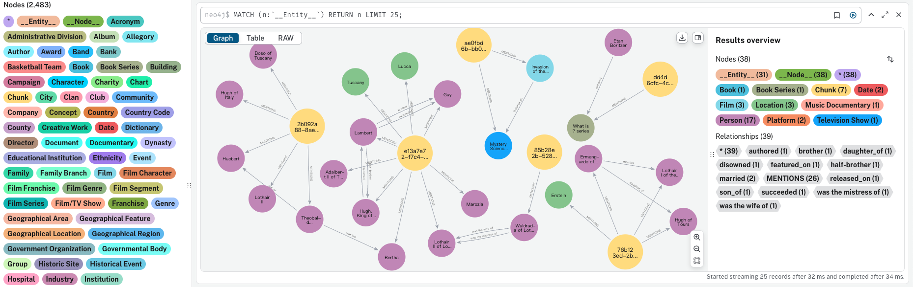

<div align="center">

<div style="margin: 20px 0;al">
  
</div>

# 🚀 RAG-Factory: Advanced and Easy-Use RAG Pipelines
</div>

<div align="center" style="line-height: 1;">
  <a href="https://arxiv.org/abs/2411.06272" target="_blank" style="margin: 2px;">
    
  </a>
  <a href="https://github.com/DataArcTech/Golden-Touchstone" target="_blank" style="margin: 2px;">
    
  </a>
  <a href="https://huggingface.co/IDEA-FinAI/TouchstoneGPT-7B-Instruct" target="_blank" style="margin: 2px;">
    
  </a>
  <a href="https://huggingface.co/IDEA-FinAI/TouchstoneGPT-7B-Instruct" target="_blank" style="margin: 2px;">
    
  </a>
</div>

A factory for building advanced RAG (Retrieval-Augmented Generation) pipelines, including:

- Standard RAG implementations
- GraphRAG architectures 
- Multi-modal RAG systems

## 🌟Features

<div>
  
</div>

- Modular design for easy customization
- Support for various knowledge graph backends
- Integration with multiple LLM providers
- Configurable pipeline components

## Installation

```bash
pip install -e .
```

## Usage
```bash
bash run.sh ToG3
```
or

```bash
python main.py --config examples/ToG3/config.yaml
```


## Examples

See the `examples/` directory for sample configurations and usage.

## Roadmap

### ✅ Implemented Features
- Vector RAG (基于Qdrant实现)
- Graph RAG (基于Neo4j实现)
- Multi-modal RAG (基于Neo4j实现文本和图像向量存储与检索)
- Lightweight SQLite Cache (轻量级缓存方案)

### 🚧 Planned Features
- ReAct QueryEngine (交互式查询引擎)
- Query Engineering:
  - Query Rewriting (查询重写)
  - Sub-Questions (子问题分解)
- Agentic RAG (智能工具选择优化性能)

## 🙏 Acknowledgements
This project draws inspiration from and gratefully acknowledges the contributions of the following open-source project:
- [llama-index](https://github.com/run-llama/llama_index)
- [llama-factory](https://github.com/hiyouga/LLaMA-Factory)
- [Qdrant](https://github.com/qdrant/qdrant)
- [Neo4j](https://github.com/neo4j/neo4j)


## ⭐ Star History

<a href="https://star-history.com/#DataArcTech/RAG-Factory&Date">
 <picture>
   <source media="(prefers-color-scheme: dark)" srcset="https://api.star-history.com/svg?repos=DataArcTech/RAG-Factory&type=Date&theme=dark" />
   <source media="(prefers-color-scheme: light)" srcset="https://api.star-history.com/svg?repos=DataArcTech/RAG-Factory&type=Date" />
   
 </picture>
</a>
<div align="center">
  <p>⭐ 如果这个项目对您有帮助，动动小手点亮Star吧！</p>
</div>

<!-- ## 🤝 Contribution

<div align="center">
  We thank all our contributors for their valuable contributions.
</div>

<div align="center">
  <a href="https://github.com/DataArcTech/RAG-Factory/graphs/contributors">
    
  </a>
</div> -->

<!-- ## 📖 Citation

```python
@misc{wu2024goldentouchstonecomprehensivebilingual,
      title={Golden Touchstone: A Comprehensive Bilingual Benchmark for Evaluating Financial Large Language Models}, 
      author={Xiaojun Wu and Junxi Liu and Huanyi Su and Zhouchi Lin and Yiyan Qi and Chengjin Xu and Jiajun Su and Jiajie Zhong and Fuwei Wang and Saizhuo Wang and Fengrui Hua and Jia Li and Jian Guo},
      year={2024},
      eprint={2411.06272},
      archivePrefix={arXiv},
      primaryClass={cs.CL},
      url={https://arxiv.org/abs/2411.06272}, 
}
``` -->


